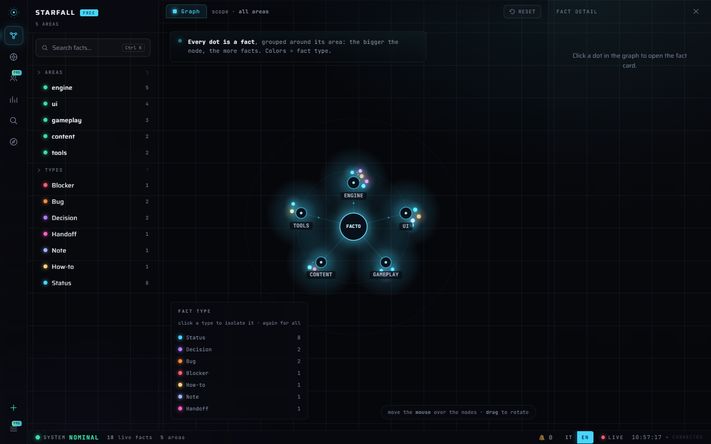

# Facto

[](LICENSE)
[](https://www.python.org/downloads/)
[](#local-by-design)
[](https://github.com/giorgiocreazione-web/facto/actions/workflows/smoke.yml)
[](https://github.com/giorgiocreazione-web/facto/actions/workflows/smoke.yml)

**Every memory tool remembers. Facto knows when it's wrong.**

Project memory for people who build with AI agents: a local engine of **dated
facts** that knows what is true *now*, **checks itself against your git repo**,
and feeds every agent session automatically — Claude Code, Cursor, Copilot,
Codex, Gemini, or whatever you use next.



## Quickstart

**macOS · Linux**

```bash
curl -LsSf https://raw.githubusercontent.com/giorgiocreazione-web/facto/main/install.sh | sh
```

**Windows** (PowerShell)

```powershell
irm https://raw.githubusercontent.com/giorgiocreazione-web/facto/main/install.ps1 | iex
```

One line. It picks the best installer you already have (uv, pipx or pip) and
gets uv for you if you have none — no Python required beforehand. Then:

```bash
cd your-project
facto connect --all   # Claude Code hook + MCP + git + AGENTS.md — and any editor it detects
facto dashboard       # Mission Control opens in your browser by itself
```

Then open your agent (`claude`, `cursor`, …) in the same folder. On first run it
receives the guided-setup playbook, explores the project, **proposes the areas
to you**, and builds the memory once you confirm — no blind auto-detection.

From then on every session opens with your briefing already injected (goal,
current state, blockers, last handoff), and the agent reads and writes the
memory through MCP on its own. If the engine ever breaks, the session is *told*
it is starting blind — no silent failures.

Requires git. Works offline. `facto --help` for everything.
*(Prefer doing it yourself? `uv tool install git+https://github.com/giorgiocreazione-web/facto.git`
— `pipx` and `pip` work the same way. If the `facto` command isn't found
afterwards, `python -m facto …` always works.)*

## Why a trust light

Every memory tool can tell you what it stored. None of them can tell you
**whether to believe it** — and stale memory is worse than no memory, because
your agent acts on it with confidence.

Facto compares what it remembers against the real state of your git repo and
says so out loud:

```
================  TRUST LIGHT  ================  (2026-07-24 10:55)
  [GREEN ] ENGINE    · aligned
  [YELLOW] UI        · memory 6 commits behind git
  [RED   ] CONTENT   · no status recorded, 2 facts possibly outdated by the code
  ----
  GLOBAL: RED   (GREEN=trust it · YELLOW=verify · RED=refresh/do not trust)
```

A memory that can say *"don't trust me"* is the only kind you can trust.

## How it works

- **Facts, not chat.** Short, dated, typed entries — *"Decision: Tailwind v4,
  Bootstrap rejected — 2026-06-19"*. A thousand facts stay searchable in
  milliseconds.
- **Bi-temporal.** A new fact *closes* the old one instead of overwriting it:
  the current picture stays clean, the history stays queryable. You can always
  ask *what did we believe in May, and why did it change?*
- **Areas, not one big blob.** The memory is split by area (engine, ui,
  content…), so each agent gets the compass of *its* corner of the project.
- <a id="local-by-design"></a>**Local by design.** One SQLite file inside your
  project. Pure Python standard library — **zero dependencies, no accounts, no
  telemetry**. The engine makes zero network calls, and the code is right here
  for you to check.

## Works with your stack

One memory, every agent — through the open standards (MCP + AGENTS.md):

| Agent | How | Wired by |
|---|---|---|
| **Claude Code** | session hook + `.mcp.json` | `facto connect --all` *(tested end-to-end)* |
| **Cursor** | `.cursor/mcp.json` + AGENTS.md | `facto connect cursor` |
| **VS Code / Copilot** | `.vscode/mcp.json` (`servers` key) + AGENTS.md | `facto connect vscode` |
| **OpenAI Codex** (CLI/VS Code/app) | `.codex/config.toml` + AGENTS.md | `facto connect codex` |
| **Gemini CLI** | `.gemini/settings.json` + AGENTS.md | `facto connect gemini` |
| **Grok Build** | reads Claude Code's MCP config | already covered by `.mcp.json` |
| **Windsurf, Zed, Cline…** | standard MCP + AGENTS.md | point them at `facto mcp-serve` |
| **Anthropic-compatible harnesses** (GLM…) | run inside Claude Code (`ANTHROPIC_BASE_URL`) | nothing extra |
| **Any other — even one that doesn't exist yet** | the universal block (`command: facto`, `args: [mcp-serve]`) | `facto connect any` |

`connect --all` wires the base (Claude Code, MCP, git, AGENTS.md) and adds an
editor **only if this project already uses it** — having Cursor installed on
your machine doesn't mean you want its folder in *this* repo. The others are
suggested, never imposed. Configs are **merged, never overwritten** (a `.bak`
is written first), and `.facto/` is added to your `.gitignore` so the database
stays out of your repo.

**No MCP at all?** Every step works from the shell too — `facto add-area`,
`facto add`, `facto handoff`, `facto status` — which is exactly what the
AGENTS.md block teaches any agent that reads it.

*Claude Code is tested end-to-end. For every other config a deterministic check
(`mcp_config_check.py`, green on Windows/macOS/Linux in CI) proves the file we
write actually launches a working Facto server — including the unknown-tool
case.*

## What your agent gets (MCP — read **and** write, in Free)

`facto_status` · `facto_brief` · `facto_search` · `facto_add_fact` ·
`facto_close_fact` · `facto_handoff` · `facto_add_area`
*(the CRM trio — entities, tasks, relations — joins in Pro).*

## The daily loop

1. **Open a session** — the hook injects the briefing. Zero re-explaining.
2. **Work** — the agent records decisions, blockers and bugs through MCP as
   they happen.
3. **Close** — `facto handoff <area>` (three guided questions) leaves the baton
   for the next session.
4. **`facto status`** — the trust light tells you whether the memory kept up.
5. **Tomorrow: start further ahead.** A silent snapshot of the database is
   taken at session start (`.facto/backups`), so months of memory never hinge
   on anyone's discipline.

## Always on (optional)

```bash
facto tray on     # start at login; on Windows, an icon next to the clock
facto tray off    # remove it — nothing is left behind
```

Opt-in, never automatic. On Windows you get a real tray icon: double-click
opens the dashboard, right-click gives you *Open dashboard* and *Quit*. On
macOS and Linux the dashboard simply starts at login, always one click away.

## The dashboard

`facto dashboard` serves **Mission Control** locally: the graph of every fact
(filter by area or type), the trust light, full-text search, the compass per
area, statistics — and **Compose**, to write facts, handoffs and closures
straight from the browser when you don't feel like opening a terminal.
English and Italian. Pro-only views appear as honest cards, never as traps.

## Editions

- **Free — this repo, MIT.** Engine, full CLI, session hook, complete MCP
  (read *and* write), Mission Control including Compose, tray. Forever.
- **Pro** *(coming)* — CRM with git auto-import, backups with retention,
  encryption, access control, exports, project templates, browser onboarding.
- **Max** *(coming)* — team sync over git (no server required) and the agent
  fleet orchestrator.

## Learn more

- [docs/CONCEPTS.md](docs/CONCEPTS.md) — facts, areas, the compass, the light.
- [docs/SETUP.md](docs/SETUP.md) — manual setup, hook details, folder mode.
- [examples/game-dev](examples/game-dev) — a worked example configuration.

MIT © Giorgio Cristea
