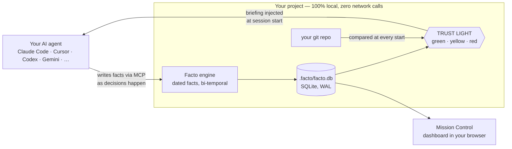

# Facto

[](https://github.com/giorgiocreazione-web/facto/blob/main/LICENSE)
[](https://www.python.org/downloads/)
[](#local-by-design)
[](https://github.com/giorgiocreazione-web/facto/actions/workflows/smoke.yml)
[](https://github.com/giorgiocreazione-web/facto/actions/workflows/smoke.yml)

**Every memory tool remembers. Facto knows when it's wrong.**

Project memory for people who build with AI agents: a local engine of **dated
facts** that knows what is true *now*, **checks itself against your git repo**,
and feeds every agent session automatically — Claude Code, Cursor, Copilot,
Codex, Gemini, or whatever you use next.


## Quickstart

```bash
uv tool install facto-memory        # or: pipx install facto-memory / pip install facto-memory
```

No `uv`? One line installs everything, even on a machine with no Python at all:

**macOS · Linux**

```bash
curl -LsSf https://raw.githubusercontent.com/giorgiocreazione-web/facto/main/install.sh | sh
```

**Windows** (PowerShell)

```powershell
irm https://raw.githubusercontent.com/giorgiocreazione-web/facto/main/install.ps1 | iex
```

Then wire your project:

```bash
cd your-project
facto connect --all   # Claude Code hook + MCP + git + AGENTS.md — and any editor it detects
facto dashboard       # Mission Control opens in your browser by itself
```

Now open your agent (`claude`, `cursor`, …) in the same folder. On first run it
receives the guided-setup playbook, explores the project, **proposes the areas
to you**, and builds the memory once you confirm — no blind auto-detection.

From then on every session opens with your briefing already injected (goal,
current state, blockers, last handoff), and the agent reads and writes the
memory through MCP on its own. If the engine ever breaks, the session is *told*
it is starting blind — no silent failures.

Requires git. Works offline. `facto --help` for everything.
*(If the `facto` command isn't found afterwards, `python -m facto …` always works.)*

## Why a trust light

Every memory tool can tell you what it stored. None of them can tell you
**whether to believe it** — and stale memory is worse than no memory, because
your agent acts on it with confidence.

Facto compares what it remembers against the real state of your git repo at
every start, and says so out loud:

```
================  TRUST LIGHT  ================  (2026-07-24 19:28)
  [GREEN ] ENGINE    · aligned
  [YELLOW] UI        · memory 2 commits behind git
  [RED   ] CONTENT   · no status recorded, 4 facts possibly outdated by the code
  ----
  GLOBAL: RED   (GREEN=trust it · YELLOW=verify · RED=refresh/do not trust)
```

A memory that can say *"don't trust me"* is the only kind you can trust.

## How it works



- **Facts, not chat.** Short, dated, typed entries — *"Decision: Tailwind v4,
  Bootstrap rejected — 2026-06-19"*. A thousand facts stay searchable in
  milliseconds.
- **Bi-temporal.** A new fact *closes* the old one instead of overwriting it:
  the current picture stays clean, the history stays queryable. You can always
  ask *what did we believe in May, and why did it change?*
- **Areas, not one big blob.** The memory is split by area (engine, ui,
  content…), so each agent gets the compass of *its* corner of the project.
- <a id="local-by-design"></a>**Local by design.** One SQLite file inside your
  project. Pure Python standard library — **zero dependencies, no accounts, no
  telemetry**. The engine makes zero network calls, and the code is right here
  for you to check.

## Your first 10 minutes

A real walkthrough on a fresh project — every output below is the actual
command output.

**1 · Wire the project** *(once)*

```console
$ cd starforge && facto connect --all
prepared facto.config.json (empty — the agent designs the areas on first run)
connecting (claude-code):
  [ OK ] claude-code: hook added in .claude\settings.json

NEXT — open your AI agent in this folder (claude, cursor, …):
  it gets the setup playbook, explores the project, proposes the areas,
  and builds the memory once you confirm. Prefer by hand? `facto add-area <slug> <path>`
```

**2 · Open your agent — or build the memory by hand.** The agent proposes the
areas on first run; doing it yourself is two commands:

```console
$ facto add-area engine engine --label "Engine (ECS)"
✓ area 'engine' added -> engine  [1 area(s) total]

$ facto add engine decisione "ECS over inheritance - profiled 4x faster with 10k asteroids"
+ [engine/decisione] valid_from=2026-07-24  ->  Compass: «DECISIONS / CONSTRAINTS»
```

**3 · Ask the light if the memory can be trusted:**

```console
$ facto status
================  TRUST LIGHT  ================  (2026-07-24 19:28)
  [YELLOW] ENGINE    · state not yet anchored to git — run `facto ingest-git`
  ...
```

It even tells you how to fix it:

```console
$ facto ingest-git
  engine: 2026-07-24 05547a8 [master]  (updated)
ingest-git: done.

$ facto status
  [GREEN ] ENGINE    · aligned
```

**4 · Close the session with a baton for the next one:**

```console
$ facto handoff engine
handoff saved [engine] (new, 171 chars)
```

**5 · Tomorrow, the briefing opens the session by itself** — this is what your
agent (and `facto brief engine`) gets before writing a single line:

```console
================  ENGINE  ================  (state at 2026-07-24 19:29)
  REAL GIT  >  active branch: master
  -------- WHERE WE ARE NOW --------
  - Spatial hash landed: 10k entities at 62 fps on the min-spec laptop
  -------- LAST HANDOFF — end-of-session baton --------
  - Vertical slice on track. Next: navmesh rework (gameplay), then wire mining
    tiers to the HUD heat gauge. Watch out: the collision fix still needs its
    regression test in CI.
  -------- DECISIONS / CONSTRAINTS --------
  - ECS over inheritance for entities - profiled 4x faster with 10k asteroids
```

Zero re-explaining. Every session starts further ahead.

## The dashboard

`facto dashboard` serves **Mission Control** locally. The reactor answers the
only question that matters — *can I trust this memory right now?* — then shows
where you are, the next step, and the blockers. It fills itself with the facts
your agent writes, and updates live while you work.


And when you don't feel like opening a terminal, **Compose** writes facts,
handoffs, closures and areas straight from the browser:


Plus the graph of every fact (filter by area or type), full-text search, the
compass per area and statistics. English and Italian. Pro-only views appear as
honest cards, never as traps.

## Works with your stack

One memory, every agent — through the open standards (MCP + AGENTS.md):

| Agent | How | Wired by |
|---|---|---|
| **Claude Code** | session hook + `.mcp.json` | `facto connect --all` *(tested end-to-end)* |
| **Cursor** | `.cursor/mcp.json` + AGENTS.md | `facto connect cursor` |
| **VS Code / Copilot** | `.vscode/mcp.json` (`servers` key) + AGENTS.md | `facto connect vscode` |
| **OpenAI Codex** (CLI/VS Code/app) | `.codex/config.toml` + AGENTS.md | `facto connect codex` |
| **Gemini CLI** | `.gemini/settings.json` + AGENTS.md | `facto connect gemini` |
| **Grok Build** | reads Claude Code's MCP config | already covered by `.mcp.json` |
| **Windsurf, Zed, Cline…** | standard MCP + AGENTS.md | point them at `facto mcp-serve` |
| **Anthropic-compatible harnesses** (GLM…) | run inside Claude Code (`ANTHROPIC_BASE_URL`) | nothing extra |
| **Any other — even one that doesn't exist yet** | the universal block (`command: facto`, `args: [mcp-serve]`) | `facto connect any` |

`connect --all` wires the base (Claude Code, MCP, git, AGENTS.md) and adds an
editor **only if this project already uses it** — having Cursor installed on
your machine doesn't mean you want its folder in *this* repo. The others are
suggested, never imposed. Configs are **merged, never overwritten** (a `.bak`
is written first), and `.facto/` is added to your `.gitignore` so the database
stays out of your repo.

**No MCP at all?** Every step works from the shell too — `facto add-area`,
`facto add`, `facto handoff`, `facto status` — which is exactly what the
AGENTS.md block teaches any agent that reads it.

*Claude Code is tested end-to-end. For every other config a deterministic check
(`mcp_config_check.py`, green on Windows/macOS/Linux in CI) proves the file we
write actually launches a working Facto server — including the unknown-tool
case.*

## What your agent gets (MCP — read **and** write, in Free)

`facto_status` · `facto_brief` · `facto_search` · `facto_add_fact` ·
`facto_close_fact` · `facto_handoff` · `facto_add_area` · `facto_remove_area`
*(the CRM trio — entities, tasks, relations — joins in Pro).*

## The daily loop

1. **Open a session** — the hook injects the briefing. Zero re-explaining.
2. **Work** — the agent records decisions, blockers and bugs through MCP as
   they happen.
3. **Close** — `facto handoff <area>` (three guided questions) leaves the baton
   for the next session.
4. **`facto status`** — the trust light tells you whether the memory kept up.
5. **Tomorrow: start further ahead.** A silent snapshot of the database is
   taken at session start (`.facto/backups`), so months of memory never hinge
   on anyone's discipline.

## Several agents at once

Yes — and it is a normal setup, not a hack. The database takes concurrent
readers even while someone writes (SQLite in WAL mode) and a write that finds it
busy waits its turn. *Verified, not assumed: four processes writing at the same
instant, 48 facts, none lost.*

Two things worth knowing:

- **Give them different areas.** Facts pile up without conflict, but *state* and
  *handoff* are one-per-area: if two agents write the handoff of the **same**
  area, the last one wins (the earlier is closed into history, not lost).
- **Need a hard boundary?** Launch an agent with `FACTO_AREA=<slug>` and it is
  *refused* if it tries to write anywhere else — including the project-wide area:

  ```
  error: this agent can only write to [api], not [web]
  ```

## Where your data lives (no surprises)

Every fact is written to `.facto/facto.db` **the moment it is recorded** — no
save button, nothing buffered, nothing lost if a session dies. A silent snapshot
goes to `.facto/backups` at session start (at most one every 12 hours, last ten
kept). It never leaves your machine: no account, no cloud, no telemetry — and
since the engine makes zero network calls, that is something you can check in
the code rather than take on trust.

Sessions **start** on their own — opening any agent in the folder injects the
briefing. They do **not** end on their own: ask for the handoff before you
close, or the next session knows *what* is true but not *where you were heading*.

## Always on (optional)

```bash
facto tray on     # start at login; on Windows, an icon next to the clock
facto tray off    # remove it — nothing is left behind
```

Opt-in, never automatic. On Windows you get a real tray icon: double-click
opens the dashboard, right-click gives you *Open dashboard* and *Quit*. On
macOS and Linux the dashboard simply starts at login, always one click away.

## Editions

| | **Free** — this repo | **Pro** *(coming)* | **Max** *(coming)* |
|---|---|---|---|
| Engine: dated facts, bi-temporal history, trust light | ✅ | ✅ | ✅ |
| Full CLI + session hook + snapshots | ✅ | ✅ | ✅ |
| Complete MCP — read **and** write | ✅ | ✅ | ✅ |
| Mission Control incl. Compose, EN/IT | ✅ | ✅ | ✅ |
| Tray / start at login | ✅ | ✅ | ✅ |
| CRM with git auto-import (entities · tasks · relations) | — | ✅ | ✅ |
| Backups with retention, exports, project templates | — | ✅ | ✅ |
| Encryption at rest + dashboard access control | — | ✅ | ✅ |
| Browser onboarding wizard | — | ✅ | ✅ |
| **Team sync over git** (no server required) | — | — | ✅ |
| **Agent fleet orchestrator** | — | — | ✅ |
| License | MIT, forever | commercial | commercial |

The Free edition is not a demo: engine, CLI, MCP and dashboard are the full
thing, MIT, forever.

## Learn more

- [docs/CONCEPTS.md](https://github.com/giorgiocreazione-web/facto/blob/main/docs/CONCEPTS.md) — facts, areas, the compass, the light.
- [docs/SETUP.md](https://github.com/giorgiocreazione-web/facto/blob/main/docs/SETUP.md) — manual setup, hook details, folder mode.
- [examples/game-dev](https://github.com/giorgiocreazione-web/facto/tree/main/examples/game-dev) — a worked example configuration.
- [CHANGELOG.md](https://github.com/giorgiocreazione-web/facto/blob/main/CHANGELOG.md) — what changed, release by release.

---

MIT © Giorgio Cristea · Built and owned by [**WCA — Web Creation Agency**](https://wcagency.it)
